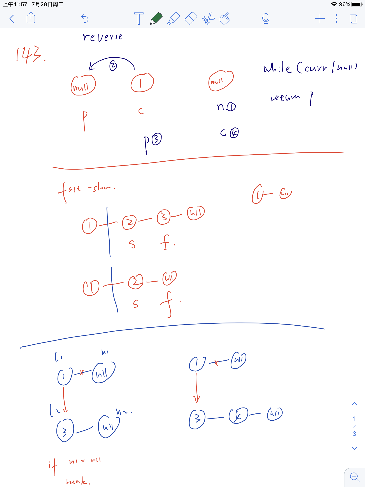

# Linked List(10)

### 138. Copy List with Random Pointer

Deep copy list with random pointer: create a map from node of input to new node. Iterative second to link the next and random. Get next and random from map(node.next).

```java
class Solution {
    public Node copyRandomList(Node head) {
        if (head == null) return null;
        HashMap<Node, Node> map = new HashMap<Node, Node>();
        Node node = head;
        while(node != null) {
            map.put(node, new Node(node.val));
            node = node.next;
        }
        node = head;
        while(node != null) {
            map.get(node).next = map.get(node.next);
            map.get(node).random = map.get(node.random);
            node = node.next;
        }
        return map.get(head);
    }
}
```


## Sum using carry

### 2. Add Two Numbers

Use carry to implement add: carry % 10, carry /= 10

Use l1 != null, l2 != null, carry !=0 to stop

```java
class Solution {
    public ListNode addTwoNumbers(ListNode l1, ListNode l2) {
        ListNode res = new ListNode(0);
        ListNode dummy = res;
        int carry = 0;
        while (l1 != null || l2 != null || carry != 0) {
            if (l1 != null) {
                carry += l1.val;
                l1 = l1.next;
            }
            if (l2 != null) {
                carry += l2.val;
                l2 = l2.next;
            }
            res.next = new ListNode(carry%10);
            carry /= 10;
            res = res.next;
        }
        return dummy.next;
    }
}
```

### 445. Add Two Numbers II

use stack to reverse the list and trick part with node.next

Stack: s.push() pop() empty()

```java
class Solution {
    public ListNode addTwoNumbers(ListNode l1, ListNode l2) {
        Stack<Integer> s1 = new Stack<Integer>();
        Stack<Integer> s2 = new Stack<Integer>();
        while (l1 != null) {
            s1.push(l1.val);
            l1 = l1.next;
        }
        while (l2 != null) {
            s2.push(l2.val);
            l2 = l2.next;
        }
        int carry = 0;
        ListNode res = new ListNode(0);
        while (!s1.empty() || !s2.empty() || carry != 0) {
            if (!s1.empty())
                carry += s1.pop();
            if (!s2.empty())
                carry += s2.pop();
            res.val = carry%10;
            carry /= 10;
            ListNode newNode = new ListNode(0);
            newNode.next = res;
            res = newNode;
        }
        return res.next;
    }
}
```


## Reverse use Prev, Curr, Next

### 206. Reverse Linked List

reverse: prev-curr-next: 1. set next. 2. set backward pointer. 3. move prev and curr

```java
class Solution {
    public ListNode reverseList(ListNode head) {
        if (head==null) return null;
        ListNode prev = null, curr = head, next = curr.next;
        while(curr!=null) {
            next = curr.next;
            curr.next = prev;
            prev = curr;
            curr = next;
        }
        return prev;
    }
}
```


### 92. Reverse Linked List II

Prev --> start --> then

Create dummy to add new node in front of input.

move prev to the one before [m,n]

iterate for n-m times: Keep put then after prev, start point to the last one.

```java
start.next = then.next; // move start first to point to next one
then.next = prev.next;// move then after p
prev.next = then;// move then after p
```

```java
then = start.next; // move t to the next one that need to be moved
```


```java
class Solution {
    public ListNode reverseBetween(ListNode head, int m, int n) {
        if (head == null) {
            return null;
        }
        ListNode dummy = new ListNode(0);
        dummy.next = head;
        ListNode prev = dummy;
        for(int i = 0; i < m - 1; i++){
            prev = prev.next;
        }
        ListNode start = prev.next;
        ListNode then = start.next;
        for (int i = 0; i < n - m; i++) {
            start.next = then.next;
            then.next = prev.next;
            prev.next = then;
            then = start.next;
        }
        return dummy.next;
    }
}
```


### 24. Swap Nodes in Pairs


creat a dummy node, use Prev-curr-then to reorder,

```java
class Solution {
    public ListNode swapPairs(ListNode head) {
        ListNode dummy = new ListNode(0);
        dummy.next = head;
        ListNode prev = dummy, curr = head, then = null;
        while(curr != null && curr.next != null){
            then = curr.next;
            curr.next = then.next;
            then.next = prev.next;
            prev.next = then;
            
            prev = curr;
            curr = curr.next;
        }
        return dummy.next;
    }
}
```


## Reorder using pointer

### 143. Reorder List



Fast-slow: slow is the head of 2nd part, 1st part will be shorter if odd

take care of [1], only 1 item: head.next == null

```java
class Solution {
    public void reorderList(ListNode head) {
      	if(head == null || head.next == null) return;
        ListNode slow = head;
        ListNode fast = head;
        ListNode prev = slow;
        while(fast != null && fast.next != null) {
            prev = slow;
            slow = slow.next;
            fast = fast.next.next;
        }
        prev.next = null;
        
        ListNode l2 = reverse(slow);
        ListNode l1 = head;
        merge(l1,l2);
    }
    private ListNode reverse(ListNode head) {
        ListNode prev = null, curr = head, next = null;
        while(curr != null){
            next = curr.next;
            curr.next = prev;
            prev = curr;
            curr = next;
        }
        return prev;
    }
    void merge(ListNode l1, ListNode l2) {
        ListNode n1 = null, n2 = null;
        while(l1 != null){
            n1 = l1.next;
            n2 = l2.next;
            l1.next = l2;
            if (n1 == null){
                break; // l1 is shorter than l2
            }
            l2.next = n1;
            l1 = n1;
            l2 = n2;
        }
    }
}
```


### 148. Sort List

Merge sort, use slow-fast to split into two parts.

```java
class Solution {
    public ListNode sortList(ListNode head) {
        if(head == null || head.next ==null) return head;
        ListNode slow = head, fast = head, prev = head;
        while(fast != null && fast.next != null){
            prev = slow;
            slow = slow.next;
            fast = fast.next.next;
        }
        prev.next = null;
        ListNode l1 = sortList(head);
        ListNode l2 = sortList(slow);
        return merge(l1,l2);
    }
    private ListNode merge(ListNode l1, ListNode l2){
        ListNode dummy = new ListNode(0);
        ListNode p = dummy;
        while(l1!=null && l2!=null){
            if(l1.val <= l2.val){
                p.next = l1;
                l1 = l1.next;
                p = p.next;
            } else {
                p.next = l2;
                l2 = l2.next;
                p = p.next;
            }
        }
        if (l1 !=null){
            p.next = l1;
        }
        if (l2 !=null){
            p.next = l2;
        }
        return dummy.next;
    }
}
```


### 86. Partition List

create 2 new linkedlist to store elements smaller and larger, then merge together.

remember to modify the next of the last element in l2.

```java
class Solution {
    public ListNode partition(ListNode head, int x) {
        ListNode dummy1 = new ListNode(0);
        ListNode dummy2 = new ListNode(0);
        ListNode l1 = dummy1;
        ListNode l2 = dummy2;
        while(head != null){
            if (head.val < x){
                l1.next = head;
                l1 = l1.next;
            } else {
                l2.next = head;
                l2 = l2.next;
            }
            head = head.next;
        }
        l1.next = dummy2.next;
        l2.next = null;
        return dummy1.next;
    }
}
```


### 430. Flatten a Multilevel Doubly Linked List

built next-prev relation between temp and p.next, p and p.child

only move p when p don't have child.

```java
class Solution {
    public Node flatten(Node head) {
        if(head == null) return null;
        Node p = head;
        while(p!= null){
            if (p.child == null){
                p = p.next;
            } else {
                Node temp = p.child;
                while(temp.next != null){
                    temp = temp.next;
                }
                temp.next = p.next;
                if(p.next != null)
                    p.next.prev = temp;
                p.next = p.child;
                p.next.prev = p;
                p.child = null;
            }
        }
        return head;
    }
}
```


# Two Pointer(9)

## Shrink left or right

### 15. 3Sum

Int[]: nums.length, Arrays.sort(nums), Arrays.asList(nums[i],nums[lo],nums[hi])

sort to avoid duplicate, then loop through all element for the outer, use BS to search matched two elements.

to avoid duplicate in outer loop, start from index=1, nums[i] != nums[i-1]; or index=0

to avoid duplicate in inner loop, use while(lo < hi, nums[lo]==nums[lo+1]) lo++ to keep move, and move one more step to the different value.

```java
class Solution {
    public List<List<Integer>> threeSum(int[] nums) {
        Arrays.sort(nums);
        List<List<Integer>> res = new LinkedList<>();
        for(int i = 0; i < nums.length - 2; i++){
            if(i==0 || (i>0 && nums[i]!=nums[i-1])){
                int lo = i + 1, hi = nums.length - 1, target = -nums[i];
                while(lo < hi) {
                    if (nums[lo] + nums[hi] == target){
                        res.add(Arrays.asList(nums[i],nums[lo],nums[hi]));
                        while(lo < hi && nums[lo] == nums[lo+1]){
                            lo++;
                        }
                        while(lo < hi && nums[hi] == nums[hi-1]){
                            hi--;
                        }
                        lo++;
                        hi--;
                    } else if(nums[lo] + nums[hi] < target) {
                        lo++;
                    } else {
                        hi--;
                    }
                } 
            }
            
        }
        return res;
    }
}
```


### 16. 3Sum Closest

sort first, then use BS to find the closet pair.

```java
class Solution {
    public int threeSumClosest(int[] nums, int target) {
        int res = nums[0] + nums[1] + nums[2];
        Arrays.sort(nums);
        for(int i = 0; i < nums.length - 2; i++){
            int lo = i + 1;
            int hi = nums.length - 1;
            while(lo < hi){
                int sum = nums[lo] + nums[hi] + nums[i];
                if (Math.abs(target - sum) < Math.abs(target - res)) {
                    res = sum;
                }
                if (sum < target){
                    lo++;
                } else {
                    hi--;
                }
                
            }
        }
        return res;
    }
}
```


### 11. Container With Most Water

set the baseline using left and right, move inside to find better one.

```java
class Solution {
    public int maxArea(int[] height) {
        int i = 0, j = height.length - 1;
        int res = 0;
        while(i < j){
            res = Math.max(res, (j - i) * Math.min(height[i],height[j]));
            if(height[i] < height[j]){
                i+=1;
            } else {
                j-=1;
            }
        }
        return res;
    }
}
```


## Fast-slow

### 142. Linked List Cycle II

use slow and fast to detect a cycle

Put slow back to head, put fast at the intersect, move at same speed, meet at the entry point

```java
public class Solution {
    public ListNode detectCycle(ListNode head) {
        ListNode intersect = getIntersect(head);
        if (intersect == null) return null;
        ListNode p1 = head, p2 = intersect;
        while(p1 != p2){
            p1 = p1.next;
            p2 = p2.next;
        }
        return p1;
    }
    private ListNode getIntersect(ListNode head) {
        ListNode tortoise = head, hare = head;
        while(hare!=null && hare.next !=null){
            tortoise = tortoise.next;
            hare = hare.next.next;
            if(tortoise == hare){
                return tortoise;
            }
        }
        return null;
    }
}
```


### 287. Find the Duplicate Number

when there is a duplicate number, there will be two maps to the same one, it is a cycle. Use list cycle to detect the entry point, which is mapped by two index.

run 1 step before the while to avoid.

```java
class Solution {
    public int findDuplicate(int[] nums) {
        int slow = nums[0], fast = nums[nums[0]];
        while(slow != fast){
            slow = nums[slow];
            fast = nums[nums[fast]];
        }
        slow = 0;
        while(slow != fast){
            slow = nums[slow];
            fast = nums[fast];
        }
        return slow;
    }
}
```


### 19. Remove Nth Node From End of List

use slow.next = slow.next.next to delete

need to create a dummy node before the input, otherwise cannot delete the first element.

Fast-slow: fast move n+1 step more than slow.

```java
class Solution {
    public ListNode removeNthFromEnd(ListNode head, int n) {
        ListNode start = new ListNode(0);
        start.next = head;
        ListNode slow = start, fast = start;
        for(int i = 0; i < n+1; i++){
            fast = fast.next;
        }
        while(fast != null){
            slow = slow.next;
            fast = fast.next;
        }
        slow.next = slow.next.next;
        return start.next;
    }
}
```

## Interval

### 763. Partition Labels

int[] map = new int[26];

Use map to record the last index of each char.

use start and last to record current substring, use last - start + 1 to record length, update as start = last +1

keep update current max last, time to start new sub is when the index of new element is larger than current max last, so the time is last == i.

the interval is that the start index of new element is larger than end index of previous interval, so to indentify intervals, we need to compare the start index of new elements with end index of current interval.

in this problem, the end index of current interval is the max last of all the char have met.

```java
class Solution {
    public List<Integer> partitionLabels(String S) {
        List<Integer> res = new LinkedList<Integer>();
        int[] map = new int[26];
        for(int i = 0; i < S.length(); i++){
            map[S.charAt(i) - 'a'] = i;
        }
        int start = 0, last = 0;
        for(int i = 0; i < S.length(); i++){
            last = Math.max(last, map[S.charAt(i) - 'a']);
            if(last == i){
                res.add(last - start + 1);
                start = last + 1;
            }
        }
        return res;
    }
}
```


### 986. Interval List Intersections

to calculate the interval: only maxstart < minend.

to choose next one: obmit the one which ends first.

For int:

```java
List<int[]> res = new LinkedList<>();

res.add(new int[]{maxstart,minend});

res.toArray(new int[res.size()][2])
```

```java
class Solution {
    public int[][] intervalIntersection(int[][] A, int[][] B) {
        int i = 0, j = 0;
        List<int[]> res = new LinkedList<>();
        while(i < A.length && j < B.length){
            int[] a = A[i];
            int[] b = B[j];
            int maxstart = Math.max(a[0],b[0]);
            int minend = Math.min(a[1],b[1]);
            if(maxstart <= minend){
                res.add(new int[]{maxstart,minend});
            }
            if(minend == a[1]) i++;
            if(minend == b[1]) j++;
        }
        return res.toArray(new int[res.size()][2]);
    }
}
```


## Safe area

### 75. Sort Colors


Balls with index < low are red, balls with index > high are green

bass with index < i are red or blue, low pointer always point to blue.

when i meet red or green it stops, if red, swap with low, so i point to blue, i++

when i meet green, swap with hi, no sure what color is high point to, so i will not ++


use two pointer low and high to mainter two area that only contains 0 or 2.

all the elements before low is 0, all the elements after hi is 2

each time meet a 0, swap i with low, low++ i++

each time meet a 2, swap i with high, high--

stop when i = high

```java
class Solution {
    public void sortColors(int[] nums) {
        int lo = 0, hi = nums.length - 1;
        for(int i = 0; i <= hi; ){
            if(nums[i] == 0) {
                int temp = nums[lo];
                nums[lo] = nums[i];
                nums[i] = temp;
                i++;
                lo++;
            }
            else if(nums[i] == 2) {
                int temp = nums[hi];
                nums[hi] = nums[i];
                nums[i] = temp;
                hi--;
            }
            else {
                i++;
            }
        }
    }
}
```


# Design

### 981. Time Based Key-Value Store

use TreeMap to get the floorKey of the timestamp

```java
TreeMap<Integer, String> treeMap = map.get(key);
Integer floor = treeMap.floorKey(timestamp);
```


```java
class TimeMap {
    private HashMap<String, TreeMap<Integer, String>> map;
    
    /** Initialize your data structure here. */
    public TimeMap() {
        map = new HashMap<>();
    }
    
    public void set(String key, String value, int timestamp) {
        if (!map.containsKey(key)) {
            map.put(key, new TreeMap<>());
        }
        map.get(key).put(timestamp, value);
    }
    
    public String get(String key, int timestamp) {
        if(!map.containsKey(key)){
            return null;
        }
        TreeMap<Integer, String> treeMap = map.get(key);
        Integer floor = treeMap.floorKey(timestamp);
        if(floor == null) return "";
        return treeMap.get(floor);
    }
}
```


# Binary Search(9)

**Pattern 1: only one possible solution**

```java
while(left <= right){
  if(){
    return
  }
  if(){
    left = mid + 1;
  } else {
    right = mid - 1;
  }
}
```

**Pattern 2: multi possible solution, only one best**

```java
while(left < right){
  if(){
    left = mid + 1; // right = mid - 1;
  } else {
    right = mid; // left = mid;
  }
}
// left == right
```

``` java
mid = (left + right) / 2 // [left,right], mid will be left
left = mid // cannot decrease search range
  
mid = (left + right + 1) / 2 // [left,right], mid will be right
right = mid // cannot decrease search range
  
// For simplify:
when left = mid occur, we need use +1;
otherwise, use not +1 as default
```

## <= if A[mid] unique

### 33. Search in Rotated Sorted Array

```java
class Solution {
    int[] nums;
    int target;
    public int search(int[] nums, int target) {
        this.nums = nums;
        this.target = target;
        int n = nums.length;
        if(n == 0) return -1;
      	// if length = 1, findIndex will error
        if(n == 1) return this.nums[0] == target? 0:-1;
        int index = findIndex(0, n - 1);
        // if not rotated
        if(index == 0)
            return search(0, n - 1);
      	// search right part
        if(nums[0] > target){
            return search(index, n -1 );
        } else {
          	// search left part
            return search(0, index);
        }
    }
    private int findIndex(int left, int right
        // if not rotated
        if (nums[left] < nums[right])
            return 0;
        while(left <= right){
            int pivot = (left + right) / 2;
            if(nums[pivot] > nums[pivot + 1]){
                return pivot + 1;
            }
            if (nums[pivot] < nums[left]){
                right = pivot - 1;
            } else {
                left = pivot + 1;
            }
        }
        return 0;
    }
    private int search(int left, int right){
        while(left <= right){
            int pivot = (left+right)/2;
            if(nums[pivot] == target){
                return pivot;
            }
            if (nums[pivot] > target){
                right = pivot - 1;
            } else {
                left = pivot + 1;
            }
        }
        return -1;
    }
}
```


### 240. Search a 2D Matrix II

initialize the current position to top right corner

```java
class Solution {
    public boolean searchMatrix(int[][] matrix, int target) {
        if(matrix == null ||matrix.length == 0 ||matrix[0].length == 0) return false;
        int col = matrix[0].length - 1;
        int row = 0;
        while(row <= matrix.length - 1 && col >= 0) {
            if(target == matrix[row][col])
                return true;
            if(target < matrix[row][col]){
                col--;    
            } else if (target > matrix[row][col]){
                row++;
            }
        }
        return false;
    }
}
```


### 378. Kth Smallest Element in a Sorted Matrix

not sorted in one direction, use BS to search range space.

if there are K numbers <= mid, then the largest one of K numbers will be result.

so for each mid, check # numbers <= mid. start from top-right, go through each row,

for each row, move left until matrix[r][c is smaller than mid.

then the col is # numbers <= mid in that row

For maxnum, we only consider the rightmost element in one row.

```java
class Solution {
    public int kthSmallest(int[][] matrix, int k) {
        int rows = matrix.length;
        int cols = matrix[0].length;
        
        int lo = matrix[0][0];
        int hi = matrix[rows - 1][cols - 1];
        while(lo <= hi){
          	// avoid int overflow
            int mid = lo + (hi - lo) / 2;
          
            int count = 0;
            int maxnum = lo;
            for(int r = 0, c = cols - 1; r < rows ; r++){
              	// find the first column that <= mid
                while(c >= 0 && matrix[r][c]>mid)
                    c--;
                if (c >= 0){
                  	// col is # numbers that <= mid
                    count += (c + 1);
                  	// record maxnum
                    maxnum = Math.max(maxnum, matrix[r][c]);
                }
                    
            }
            
            if(count == k) // there are k numbers <= mid
                return maxnum; // maxnum is the largest one in k numbers.
            else if(count < k) // mid is too small, find larger part
                lo = mid + 1;
            else 
                hi = mid - 1; // mid is too large, find smaller part
        }
        return lo;
    }
}
```


### 74. Search a 2D Matrix

treat it as a sorted list, use `matrix[mid/cols][mid%cols]` to locate it in the matrix

```java
class Solution {
    public boolean searchMatrix(int[][] matrix, int target) {
        if(matrix == null || matrix.length == 0 || matrix[0].length == 0)
            return false;
        int rows = matrix.length;
        int cols = matrix[0].length;
        int lo = 0, hi = rows * cols - 1;
        while(lo <= hi) {
            int mid = (lo + hi) / 2;
            if(matrix[mid/cols][mid%cols] == target)
                return true;
            else if(matrix[mid/cols][mid%cols] < target)
                lo = mid + 1;
            else 
                hi = mid - 1;
        }
        return false;
    }
}
```


## < if A[mid] not unique

### 34. Find First and Last Position of Element in Sorted Array

**For first poisition**

We initialize the range to [i=0, j=n-1]. In each step, calculate the middle element [mid = (i+j)/2]. Now according to the relative value of A[mid] to target, there are three possibilities:

If A[mid] < target, then the range must begins on the right of mid (hence i = mid+1 for the next iteration)
If A[mid] > target, it means the range must begins on the left of mid (j = mid-1)
If A[mid] = target, then the range must begins on the left of or at mid (j= mid)

so: if A[mid] < target: i = mid+1; if A[mid]>=target: j = mid

then testcase

```
case 1: [5 7] (A[i] = target < A[j])
case 2: [5 3] (A[i] = target > A[j])
case 3: [5 5] (A[i] = target = A[j])
case 4: [3 5] (A[j] = target > A[i])
case 5: [3 7] (A[i] < target < A[j])
case 6: [3 4] (A[i] < A[j] < target)
case 7: [6 7] (target < A[i] < A[j])
```

for case 1, 2, 3: mid = i; A[mid] = target, so j = mid; so i = j = mid, and A[i] = target

for case 4:  mid = i; A[mid] < target, so i = mid+1; so i = j = mid + 1, and A[i] = target

**For last poisition**

1. If A[mid] > target, then the range must begins on the ***left*** of mid (j = mid-1)
2. If A[mid] < target, then the range must begins on the ***right*** of mid (hence i = mid+1 for the next iteration)
3. If A[mid] = target, then the range must begins ***on the right of or at*** mid (i= mid)

so: if A[mid] <= target: i = mid; if A[mid]>target: j = mid - 1

however, for test case`[5 7], target = 5`, mid = i, i = mid, need keep the search range moving,

so use `mid = (i+j+1)/2`


```java
class Solution {
    public int[] searchRange(int[] nums, int target) {
        if (nums.length == 0)
            return new int[]{-1,-1};
        int[] res = new int[2];
        int lo = 0, hi = nums.length - 1;
        while(lo < hi){
            int m = (lo + hi) / 2;
            if (nums[m] < target) {
                lo = m + 1;
            } else { // nums[m] >= target
                hi = m;
            }
        }
        if (nums[lo] == target)
            res[0] = lo;
        else 
            res[0] = -1;
        hi = nums.length - 1;
        while(lo < hi) {
            int m = (lo + hi + 1) / 2;
            if (nums[m] > target) {
                hi = m - 1;
            } else { // nums[m] <= target
                 lo = m;
            }
        }
        if (nums[lo] == target)
            res[1] = lo;
        else 
            res[1] = -1;
        return res;
    }
}
```


### 658. Find K Closest Elements

We define to use BS to search the start of k elements.[i, i+k-1]

When x - arr[mid] = arr[mid + k] - x: we prefer to select smaller one, so move the sliding window to left, so hi = mid,

so keep the lo = mid + 1

(Mid) () () () (mid+k), if we choose 4, fix 3, we only need to figure out keep mid or mid + k.

```java
class Solution {
    public List<Integer> findClosestElements(int[] arr, int k, int x) {
        List<Integer> res = new LinkedList<>();
        int lo = 0, hi = arr.length - k;
        while(lo < hi) {
            int mid = (lo + hi) / 2;
            if (x - arr[mid] > arr[mid + k] - x){
                lo = mid + 1;
            } else {
                hi = mid;
            }
        }
        for(int i = 0; i < k; i++){
            res.add(arr[i + lo]);
        }
        return res;
    }
}
```


### 1011. Capacity To Ship Packages Within D Days

search range. when availble to ship packages within D, keep high unchanged.

```java
class Solution {
    public int shipWithinDays(int[] weights, int D) {
        int left = 0, right = 0;
        for (int w: weights){
            left = Math.max(left, w);
            right += w;
        }
        while(left < right){
            int mid = left + (right - left) / 2;
            int day = 1, curr = 0;
            for(int w: weights){
                if(curr+w > mid){
                    day+=1;
                    curr = 0;
                }
                curr += w;
            }
            if (day > D){
                left = mid + 1;
            } else { // day <= D, meet 
                right = mid;
            }
        }
        return left;
    }
}
```


### 1283. Find the Smallest Divisor Given a Threshold

When one mid meet the threshold, not mean it is the smallest one, so while(i<j)

when sum > threshold, means current divisor is too small, need larger, move left = mid + 1

when == threshold, means that current divisor is == or >, so keep same

```java
class Solution {
    public int smallestDivisor(int[] nums, int threshold) {
        int left = 1, right = Integer.MAX_VALUE;
        while(left < right){
            int mid = left + (right - left) / 2;
            int sum = 0;
            for(int n: nums){
                sum += (int)(Math.ceil((float)n / (float)mid));
            }
            if(sum > threshold){
                // divisor is too small
                // need larger divisor
                left = mid + 1;
            } else{ // sum <= threshold: meet require
                right = mid;
            }
        }
        return left;
    }
}
```


### 1060. Missing Element in Sorted Array


First, find out number of missing before each element in array using nums[i] - nums[0] - i

we want to search the largest index with missing count < K

So, if miss[mid] > k, we can safely move right = mid - 1;

when miss[mid] < k, mid may point to target or less than target, so we can only let left = mid;

when miss[mid] = k, we can safely move right = mid - 1;

So, if(miss[mid] >= k), right = mid - 1; else left = mid;

however, if we let mid =(left + right) / 2, the search range won't decrease, so we change to (l+r + 1)

```java
class Solution {/2
    public int missingElement(int[] nums, int k) {
        int left = 0, right = nums.length - 1;
        while(left < right){
            int mid = left + (right - left + 1) / 2;
            if(countMissing(nums, mid) >= k) {
                right = mid - 1;
            } else {
                left = mid;
            }
        }
        return nums[left] + (k - countMissing(nums, left));
    }
    private int countMissing(int[] nums, int i){
        return nums[i] - nums[0] - i;
    }
}
```


# Sliding window(10)

```java
int left = 0;
int count = 0;
int res = 0;
for(int right = 0; right < n; right++){
  // update state when add nums[right]
  count++;

  while(condition){
    // update state when remove nums[left] 
    count--;
    
    // shrink left
    left++;
  }
  
  // update res
  res = right - left + 1;
}
// condition1: while doesn't meet the requirement, keep shrink until meet, update res
// condition2: always meet, keep shrink when meet the requirement, judge and update res
```

## fixed size

### 239. Sliding Window Maximum

By using max Deque. We maintain list of max element candidates in **monotonically decreasing order**. Everytime the right pointer reaches a new position, we need to dequeue the "tail" element who is smaller than the nums[right]. Since, **those "old small tail" elements will never be the range maximum from now on.** After "clean up" the "old small tail" elements, add nums[right] into the deque, and then, **the head of deque is the current maximum.**


sliding window with length = k, if right most index is i, left most index is i - k + 1

for each i, only keep elements that are potentially max in [i-k+1,i] or subsequent window.

(1) discard element with index < i - k + 1 by `q.pollFirst()`

(2) delete elements in queue whose value is smaller than nums[i], 

In this way, the elements in queue are all larger than the new one nums[i], so element in queue are in decreasing order, so we scan from right to left. And the largest one is at left most index.

start from index >= k -1, record res as `nums[q.peekFirst()]`

```java
class Solution {
    public int[] maxSlidingWindow(int[] nums, int k) {
        int[] res = new int[nums.length - k + 1];
        int j = 0;
        Deque<Integer> q = new ArrayDeque<>();
        for(int i = 0; i < nums.length; i++){
            if(!q.isEmpty() && q.peekFirst() < i - k + 1){
                q.pollFirst();
            }
            while(!q.isEmpty() && nums[q.peekLast()]< nums[i]){
                q.pollLast();
            }
            q.offerLast(i);
            if(i>=k-1)
                res[j++] = nums[q.peekFirst()];
        }
        return res;
    }
}
```


### 567. Permutation in String

Creat a map to count each char in s1

using sliding window with length of s1.length() to update count

for each new element, minus char, and remove the head(i-n)

remove the head need to start from index at s1.length();

as this is a fixed length, we don't need the left pointer.

```java
class Solution {
    public boolean checkInclusion(String s1, String s2) {
        int[] count = new int[26];
        int n = s1.length();
        for(int i = 0; i < n; i++){
            count[s1.charAt(i) - 'a']++;
        }
        for(int i = 0; i < s2.length(); i++){
            count[s2.charAt(i) - 'a']--;
            if(i>=n)
                count[s2.charAt(i-n) - 'a']++;
            if(isZero(count))
                return true;
        }
        return false;
    }
    private boolean isZero(int[] counts){
        for(int n: counts){
            if (n != 0)
                return false;
        }
        return true;
    }
}
```


### 1052. Grumpy Bookstore Owner

sum up the number of custom that can be satisfy before using tech.

use sliding window to calculate how many new custom will be satifsfy if use tech in current sliding window

for each i, if it was grumpy, add new count; remove the head one at i - X if it was grumpy.

start to delte from index at X

```java
class Solution {
    public int maxSatisfied(int[] customers, int[] grumpy, int X) {
        int base = 0, addition = 0, maxAddition = 0;
        for(int i = 0; i < grumpy.length; i++){
            base += (1 - grumpy[i]) * customers[i];
        }
        for(int i = 0; i < grumpy.length; i++){
            if(grumpy[i]==1){
                addition += customers[i];
            }
            if(i >= X && grumpy[i - X]==1){
                addition -= customers[i - X];
            }
            maxAddition = Math.max(maxAddition, addition);
        }
        return base + maxAddition;
    }
}
```


## Variable size - shrink until meet

### 1438. Longest Continuous Subarray With Absolute Diff Less Than or Equal to Limit

```java
Deque<Integer> queue = new ArrayDeque<>();
queue.isEmpty()
queue.peekFirst() // get first one
queue.pollFirst() // remove first one
queue.peekLast() // get last one
queue.pollLast() // remove last one
queue.offerLast() // add to last

```


have two pointers: left and right, and then **find the longest subarray for every right pointer (iterate it) by shrinking left pointer.** And return the longest one among them.

use maxqueue and minqueue to record current max and min in current subarray[left, right]

for each i:

(1) in maxqueue: delete all previous element that smaller than new one

(2) in minqueue: delete all previous element that larger than new one

in this way, maxqueue is decreasing order, minqueue is increasing order.

to meet the requiement, need current max - min = diff <= limit

so shrink the left until diff < limit. and poll corresponding element from marquee and minqueu when shrink

if nums[left] is smaller than the head of maxqueue, we keep moving left pointer until satisfying the limit

note: as we only delete element < nums[i] in maxqueu, we will keep the duplicate elements, and in the end when we shrink the left, the duplicate one will remain in queue.

```java
class Solution {
    public int longestSubarray(int[] nums, int limit) {
        int res = 1;
        int left = 0;
        Deque<Integer> maxQueue = new ArrayDeque<>();
        Deque<Integer> minQueue = new ArrayDeque<>();
        for(int i = 0; i < nums.length; i++){
            while(!maxQueue.isEmpty() && maxQueue.peekLast() < nums[i]){
                maxQueue.pollLast();
            }
            maxQueue.offerLast(nums[i]);
            while(!minQueue.isEmpty() && minQueue.peekLast() > nums[i]){
                minQueue.pollLast();
            }
            minQueue.offerLast(nums[i]);
            
            while(maxQueue.peekFirst() - minQueue.peekFirst() > limit){
                if(maxQueue.peekFirst() == nums[left]){
                    maxQueue.pollFirst();
                }
                if(minQueue.peekFirst() == nums[left]){
                    minQueue.pollFirst();
                }
                left++;
            }
            res = Math.max(res, i - left + 1);
        }
        return res;
    }
}
```


### 1004. Max Consecutive Ones III

use count to record how many opportunities we used

when new element A[right] is 0, count++

then shrink the left and update count coordingl until count < K

```java
class Solution {
    public int longestOnes(int[] A, int K) {
        int res = 0;
        int count = 0;
        int left = 0;
        for(int right = 0; right < A.length; right++){
            if(A[right]==0){
                count++;
            }
            while(count > K){
                if(A[left]==0){
                    count--;
                }
                left++;
            }
            res = Math.max(res, right - left + 1);
        }
        return res;
    }
}
```


### 424. Longest Repeating Character Replacement

Use maxCount to record max number of char in current subarray

when length of current subarray(right - left + 1), length - maxCount > k, means that we canno change all char in subarray to same char, so need to update left pointer.

Trick part is that, the maxcount may be wrong at some point.

```java
class Solution {
    public int characterReplacement(String s, int k) {
        int res = 0, left = 0, maxCount = 0;
        int[] count = new int[26];
        for(int right = 0; right < s.length(); right++){
            count[s.charAt(right) - 'A']++;
            maxCount = Math.max(maxCount, count[s.charAt(right) - 'A']);
            while(right - left + 1 - maxCount > k){
                count[s.charAt(left) - 'A']--;
                left++;
            }
            res = Math.max(res, right - left + 1);
        }
        return res;
    }
}
```


### 159. Longest Substring with At Most Two Distinct Characters

use count to record number of char in current subarray, use diffCount to record how many diff char in subarray

```java
class Solution {
    public int lengthOfLongestSubstringTwoDistinct(String s) {
        int res = 0;
        int left = 0;
        int[] count = new int[100];
        int diffCount = 0;
        for(int right = 0; right < s.length(); right++){
            int cRight = s.charAt(right) - 'A';
            if(count[cRight] == 0)
                diffCount++;
            count[cRight]++;
            while(diffCount > 2){
                int cLeft = s.charAt(left) - 'A';
                count[cLeft]--;
                if(count[cLeft]==0)
                    diffCount--;
                left++;
            }
            res = Math.max(res, right - left + 1);
        }
        return res;
    }
}
```


### 3. Longest Substring Without Repeating Characters

record current longest substring, update the max res.

keep shrink left when thre are multi repeating char in current subarray

```java
class Solution {
    public int lengthOfLongestSubstring(String s) {
        HashSet<Character> set = new HashSet<Character>();
        int res = 0;
        int slow = 0;
        int[] count = new int[1000];
        for(int fast = 0; fast < s.length(); fast++){
            count[s.charAt(fast)-'A']++;
            while(count[s.charAt(fast)-'A']>1){
                count[s.charAt(slow)-'A']--;
                slow++;
            }
            res = Math.max(res, fast - slow + 1);
        }
        return res;
    }
}
```

## Variable size - shrink when meet

### 209. Minimum Size Subarray Sum

keep shrink when meet the require,

need judge before update res

```java
class Solution {
    public int minSubArrayLen(int s, int[] nums) {
        int left = 0, res = nums.length, sum = 0;
        boolean flag = false;
        for(int right = 0; right < nums.length; right++){
            sum += nums[right];
            while(sum - nums[left] >= s){
                sum -= nums[left];
                left++;
            }
            if(sum >= s){
                res = Math.min(res, right - left + 1);
                flag = true;
            }
                
        }
        return flag ? res : 0;
    }
}
```


### 76. Minimum Window Substring

use count to record the demand, when new element at right index occur, use -- to meet the demand

keep shrink the left pointer while it meets the demand(count[s.charAt(left) - 'A'] < 0)

```JAVA
class Solution {
    public String minWindow(String s, String t) {
        String res = s;
        boolean flag = false;
        
        int[] count = new int[100];
        for(int i = 0; i < t.length(); i++){
            count[t.charAt(i) - 'A']++;
        }
        
        int left = 0; 
        for(int right = 0; right < s.length(); right++){
            count[s.charAt(right) - 'A']--;
            
            while(left < s.length() && count[s.charAt(left) - 'A'] < 0){
                count[s.charAt(left) - 'A']++;
                left++;
            }
            
            if(isValid(count) && res.length() >= right - left + 1){
                res = s.substring(left,right+1);
                flag = true;
            }
        }
        
        return flag? res : "";
    }
    private boolean isValid(int[] count){
        for(int c: count)
            if (c > 0)
                return false;
        return true;
    }
}
```


# Stack(4)

## Parentheses

### 20. Valid Parentheses

```java
String s;
s.toCharArray();
Stack s;
s.isEmpty(), s.pop(), s.push()
```


```java
class Solution {
    public boolean isValid(String s) {
        Stack<Character> stack = new Stack<>();
        for(char c: s.toCharArray()){
            if(c == '('){
                stack.push(')');
            } else if (c =='{'){
                stack.push('}');
            } else if (c =='[') {
                stack.push(']');
            } else {
                if (stack.isEmpty())
                    return false;
                char t = stack.pop();
                if(t != c){
                    return false;
                }
            }
        }
        return stack.isEmpty();
    }
}
```


### 1249. Minimum Remove to Make Valid Parentheses

```java
StringBuilder sb = new StringBuilder(s);
sb.setCharAt(i, '*');
sb.toString().replaceAll("\\*","");
```

mark all the char that need to be removed as *, and replace with "" in the end

to find all the index, push index of ( into stack 

when meet ), pop; if stack is empty, mark current index.

in the end, the index of ( in stack need to be removed.

```java
class Solution {
    public String minRemoveToMakeValid(String s) {
        Stack<Integer> stack = new Stack<>();
        StringBuilder sb = new StringBuilder(s);
        for(int i = 0; i < s.length(); i++){
            char c = s.charAt(i);
            if(c=='('){
                stack.push(i);
            }
            else if (c==')'){
                if(!stack.isEmpty()){
                    stack.pop();
                } else{
                    sb.setCharAt(i, '*');
                }
            }
        }
        while(!stack.isEmpty()){
            int i = stack.pop();
            sb.setCharAt(i,'*');
        }
        return sb.toString().replaceAll("\\*","");
    }
}
```

## Keep pop

### 739. Daily Temperatures

when meet a larger temp, keep pop the top ones and record the distance of index

```java
class Solution {
    public int[] dailyTemperatures(int[] T) {
        int[] res = new int[T.length];
        Stack<Integer> stack = new Stack<>();
        for(int i = 0; i < T.length; i++){
            while(!stack.isEmpty() && T[stack.peek()] < T[i] ){
                int index = stack.pop();
                res[index] = i - index;
            }
            stack.push(i);
        }
        return res;
    }
}
```


### 735. Asteroid Collision

```java
stack.stream().mapToInt(x -> x).toArray();
```


```java
class Solution {
    public int[] asteroidCollision(int[] asteroids) {
        Stack<Integer> stack = new Stack<>();
        for(int a: asteroids){
            if(!stack.isEmpty() && a < 0 && stack.peek() > 0){ // + -
                // 5 -1 do nothing
                collision:{// 5 -10 or 5 -5
                    while(!stack.isEmpty() && stack.peek() > 0 && -a >= stack.peek()){
                        if(-a == stack.peek()){// 5 -5
                            stack.pop();
                            break collision;
                        }
                        stack.pop();
                    }
                    // when stop, (10 -5) or (- -) or (null -)
                    if(stack.isEmpty() || stack.peek() < 0)
                        stack.push(a);
                }
            } else {
                stack.push(a);
            }
        }
        return stack.stream().mapToInt(x -> x).toArray();
    }
}
```

# Heap(6)

### 23. Merge k Sorted Lists

```java
// (a,b)->a.val - b.val: if a < b, return -1, put a first
PriorityQueue<ListNode> pq = new PriorityQueue<>(lists.length,(a,b)->a.val - b.val);
```

use the pq to select who is the smallest one, connect the res, then put next, which is the head of remaining list into the pq for further comparision 

```java
class Solution {
    public ListNode mergeKLists(ListNode[] lists) {
        if(lists == null || lists.length == 0) return null;
        PriorityQueue<ListNode> pq = new PriorityQueue<>(lists.length,(a,b)->a.val - b.val);
        for(ListNode node: lists){
            if(node != null)
                pq.offer(node);
        }
        ListNode dummy = new ListNode(0);
        ListNode curr = dummy;
        while(!pq.isEmpty()){
            curr.next = pq.poll();
            curr = curr.next;
            if(curr.next != null){
                pq.offer(curr.next);
            }
        }
        return dummy.next;
    }
}
```


### 973. K Closest Points to Origin

```java
pq.toArray(new int[K][2]);
```


use max pq to keep k element, when exceed the size, poll out the maximum one

```java
class Solution {
    public int[][] kClosest(int[][] points, int K) {
        PriorityQueue<int[]> pq = new PriorityQueue<>(K, (a,b) -> (-a[0]*a[0] - a[1]*a[1] + b[0]*b[0] + b[1]*b[1]));
        for(int[] point: points){
            pq.offer(point);
            if(pq.size() > K)
                pq.poll();
        }
        return pq.toArray(new int[K][2]);
    }
}
```


### 692. Top K Frequent Words

```java
for(Map.Entry<String, Integer> entry: map.entrySet())
entry.getKey()
entry.getValue()
// number from low to high, increase order: a - b
// char from high to low, decrease order: b.getKey().compareTo(a.getKey())
PriorityQueue<Map.Entry<String, Integer>> pq = new PriorityQueue<>((a,b)->
                 (a.getValue() == b.getValue() ? b.getKey().compareTo(a.getKey())  : 												a.getValue() - b.getValue()));
```


```java
class Solution {
    public List<String> topKFrequent(String[] words, int k) {
        HashMap<String, Integer> map = new HashMap<>();
        for(String w: words){
            if(!map.containsKey(w))
                map.put(w, 0);
            map.put(w, map.get(w) + 1);
        }
        PriorityQueue<Map.Entry<String, Integer>> pq = new PriorityQueue<>(
            (a,b)->(a.getValue() == b.getValue() ? b.getKey().compareTo(a.getKey())  : a.getValue() - b.getValue())
        );
        for(Map.Entry<String, Integer> entry: map.entrySet()){
            pq.offer(entry);
            if(pq.size()>k){
                pq.poll();
            }
        }
        List<String> res = new LinkedList<>();
        while(!pq.isEmpty()){
            res.add(0, pq.poll().getKey());
        }
        return res;
    }
}
```


### 295. Find Median from Data Stream

use Large to keep the maximum half of the data

use Small to keep the minmum half of the data

Use minHeap to implement Large, use maxHeap to implement Small

each time, insert new element into Large, then move the smallest one from Large to Small

When small size > large size, move largest one from Small into Large

```java
class MedianFinder {
    Queue<Integer> large;
    Queue<Integer> small;

    /** initialize your data structure here. */
    public MedianFinder() {
        large = new PriorityQueue<>();
        small = new PriorityQueue<>((a,b)->(b-a));
    }
    
    public void addNum(int num) {
        large.offer(num);
        small.offer(large.poll());
        if(small.size() > large.size()){
            large.offer(small.poll());
        }
    }
    
    public double findMedian() {
        if(large.size() > small.size()){
            return large.peek();
        } else {
            return (large.peek() + small.peek()) / 2.0;
        }
    }
}
```


### 767. Reorganize String

use map and pq to get the char whose freq is largest

when new char is the same as the last char in sb, poll for second time to get the second largest char

```java
Map.Entry<Character, Integer> entry: map.entrySet()
entry.getKey()
entry.setValue(entry.getValue() - 1)
```


```java
class Solution {
    public String reorganizeString(String S) {
        HashMap<Character, Integer> map = new HashMap<>();
        for(char c: S.toCharArray()){
            map.put(c, map.getOrDefault(c,0)+1);
        }
        Queue<Map.Entry<Character, Integer>> queue = new PriorityQueue<>(
            (a,b)->(b.getValue() - a.getValue()));
        for(Map.Entry<Character, Integer> entry: map.entrySet()){
            queue.offer(entry);
        }
        StringBuilder sb = new StringBuilder();
        while(!queue.isEmpty()){
            Map.Entry<Character, Integer> entry = queue.poll();
            if(sb.length() == 0 || entry.getKey() != sb.charAt(sb.length() - 1)){
                sb.append(entry.getKey());
                entry.setValue(entry.getValue() - 1);
                if(entry.getValue() > 0){
                    queue.offer(entry);
                }
            } else {
                if (queue.isEmpty())
                     return "";
                Map.Entry<Character, Integer> second = queue.poll();
                sb.append(second.getKey());
                second.setValue(second.getValue() - 1);
                if(second.getValue() > 0){
                    queue.offer(second);
                }
                queue.offer(entry);
            }
        }
        return sb.toString();
    }
}
```


### 347. Top K Frequent Elements

nothing special: use map and pq, use minHeap to maintain the largest k elements

```java
class Solution {
    public int[] topKFrequent(int[] nums, int k) {
        HashMap<Integer, Integer> map = new HashMap<>();
        for(int n: nums){
            map.put(n, map.getOrDefault(n, 0) + 1);
        }
        Queue<Map.Entry<Integer, Integer>> pq = new PriorityQueue<>((a,b)->(a.getValue()-b.getValue()));
        for(Map.Entry<Integer, Integer> e: map.entrySet()){
            pq.offer(e);
            if(pq.size() > k){
                pq.poll();
            }
        }
        int[] res = new int[pq.size()];
        int i = 0;
        while(!pq.isEmpty())
            res[i++] = pq.poll().getKey();
        return res;
    }
}
```

# Intervals(6)

```java
|---|
 |-|
 |----|
  		|--|
  
```

- Sort intervals/pairs in increasing order of the start position.
- Scan the sorted intervals, and maintain an "active set" for overlapping intervals. At most times, we do not need to use an explicit set to store them. Instead, we just need to maintain several key parameters, e.g. the number of overlapping intervals (count), the minimum ending point among all overlapping intervals (minEnd).
- If the interval that we are currently checking overlaps with the active set, which can be characterized by cur.start > minEnd, we need to renew those key parameters or change some states.
- If the current interval does not overlap with the active set, we just drop current active set, record some parameters, and create a new active set that contains the current interval.

```java
int count = 0; // Global parameters
int minEnd = Integer.MIN(MAX)_VALUE; // "active set" for overlapping intervals, e.g. the minimum ending point among all overlapping intervals.
Arrays.sort(intervals, (a,b)->(a[0] - b[0])); // ascending order of starting point
for(int[] interval: intervals){
  if(interval[0] > minEnd){
    // changing some states, record some information, and start a new active set.
    count++;
    minEnd = interval[1];
  } else{
    // renew key parameters of the active set
    minEnd = min(minEnd, interval[1]);
    minEnd = max(minEnd, interval[1]);
  }
}
```


### 252. Meeting Rooms

person could attend all meetings.

Sort the start time, from left, if new interval's start before last one's end: false

```java
class Solution {
    public boolean canAttendMeetings(int[][] intervals) {
        Arrays.sort(intervals, (a,b)->(a[0] - b[0]));
        int minEnd = Integer.MIN_VALUE;
        for(int i = 0; i < intervals.length; i++){
            if(intervals[i][0] < minEnd){
                return false;
            } else {
                minEnd = intervals[i][1];
            }
        }
        return true;
    }
}
```

### 253. Meeting Rooms II(earliest ending)

sort using the start time by default

use pq to record rooms are taken, the value is the end time

so the pq will give the earlest ending time of current taken rooms

so add the first interval

then for each interval, see if the earlest ending room is ealier than start time of curr interval

if curr[start] >= pq.peek(): if reuse the room, so end the previous room, then added new in

Else: cannot reust, add new room with its end time into the pq

```java
class Solution {
    public int minMeetingRooms(int[][] intervals) {
        if(intervals == null || intervals.length == 0) return 0;
        Queue<Integer> pq = new PriorityQueue<>();
        Arrays.sort(intervals, (a,b)->(a[0] - b[0]));
        int minEnd = Integer.MAX_VALUE;
        for(int[] interval: intervals){
            if(interval[0] >= minEnd){
                pq.poll();
            }
            pq.offer(interval[1]);
            minEnd = pq.peek();
        }
        return pq.size();
    }
}
```


### 56. Merge Intervals

sort using start, add first interval into res

for each new interval, if new[start] > res.peekLast, just add new one

else: change the last interval's end time to the max ending time

```java
class Solution {
    public int[][] merge(int[][] intervals) {
        if(intervals == null || intervals.length == 0)
            return new int[0][];
        LinkedList<int[]> res = new LinkedList<>();
        Arrays.sort(intervals, (a,b)->(a[0]-b[0]));
        int minEnd = Integer.MIN_VALUE;
        for(int i = 0; i < intervals.length; i++){
            if(intervals[i][0] <= minEnd){
                minEnd = Math.max(minEnd, intervals[i][1]);
                res.peekLast()[1] = minEnd;
            } else{
                res.add(intervals[i]);
                minEnd = intervals[i][1];
            }
        }
        return res.toArray(new int[res.size()][2]);
    }
}
```


### 452. Minimum Number of Arrows to Burst Balloons

sort using start time, if new interval.start < curr.end: update the arrow position

else: new.start > curr.end, need a new arrow to shoot at new.end

```java
class Solution {
    public int findMinArrowShots(int[][] points) {
        if(points == null || points.length == 0) return 0;
        Arrays.sort(points, (a,b)->(a[0] - b[0]));
        int count = 1;
        int minEnd = Integer.MAX_VALUE;
        for(int i = 0; i < points.length; i++){
            int[] t = points[i];
            if (minEnd < t[0]){
                count++;
                minEnd = t[1];
            } else{
                minEnd = Math.min(minEnd, t[1]);
            }
        }
        return count;
    
    }
}
```


### 435. Non-overlapping Intervals

always pick the interval with the earliest end time. Then you can get the maximal number of non-overlapping intervals. (or minimal number to remove).
This is because, the interval with the earliest end time produces the maximal capacity to hold rest intervals.

So for each interval, if its start time > available space(end), count++, and update new availabel space

else: we don't want the interval, just continue to skip

```java
class Solution {
    public int eraseOverlapIntervals(int[][] intervals) {
        if(intervals.length == 0) return 0;
        Arrays.sort(intervals, (a,b) ->(a[0] - b[0]));
        int count = 0;
        int minEnd = Integer.MIN_VALUE;
        for(int i = 0; i < intervals.length; i++){
            if(minEnd <= intervals[i][0]) {
                count++;
                minEnd = intervals[i][1];
            } else {
                minEnd = Math.min(minEnd, intervals[i][1]);
            }
        }
        return intervals.length - count;
    }
}
```


### 763. Partition Labels

```JAVA
class Solution {
    public List<Integer> partitionLabels(String S) {
        List<Integer> res = new LinkedList<Integer>();
        int[] map = new int[26];
        for(int i = 0; i < S.length(); i++){
            map[S.charAt(i) - 'a'] = i;
        }
        
        int minEnd = 0;
        int start = 0;
        for(int i = 0; i < S.length(); i++){
            if(i > minEnd){
                res.add(i - 1 - start + 1);
                start = i;
                minEnd = map[S.charAt(i) - 'a'];
            } else{
                minEnd = Math.max(minEnd, map[S.charAt(i) - 'a']);
            }
        }
        res.add(S.length() - start);
        return res;
    }
}
```


### 729. My Calendar I

use treemap to find the previous interval and next interval, compare start and end

```java
class MyCalendar {
    TreeMap<Integer, Integer> calendar;
    public MyCalendar() {
        calendar = new TreeMap<>();
    }
    
    public boolean book(int start, int end) {
        Integer prevStart = calendar.floorKey(start),
            nextStart = calendar.ceilingKey(start);
        if((prevStart == null || calendar.get(prevStart) <= start) 
           && (nextStart == null || nextStart >= end)) {
            calendar.put(start,end);
            return true;
        }
        else 
            return false;
    }
}
```


# Recursion(8)

### 938. Range Sum of BST

```java
class Solution {
    int L, R;
    public int rangeSumBST(TreeNode root, int L, int R) {
        this.L = L;
        this.R = R;
        return dfs(root);
    }
    private int dfs(TreeNode node){
        if(node == null) return 0;
        if(L <= node.val && node.val <= R){
            return node.val + dfs(node.left) + dfs(node.right);
        }
        else if (node.val < L)
            return dfs(node.right);
        else
            return dfs(node.left);
    }
}
```


### 394. Decode String

```java
Character.isDigit(c)
s.toCharArray()
StringBuilder sb = new StringBuilder()
sb.append(tmp)
sb.toString()
```

define the helper to handle case: ab23[xxx]

```java
class Solution {
    public String decodeString(String s) {
        Deque<Character> queue = new ArrayDeque<>();
        for(char c: s.toCharArray()){
            queue.offer(c);
        }
        return helper(queue);
    }
    private String helper(Deque<Character> queue){
        int num = 0;
        StringBuilder sb = new StringBuilder();
        while(!queue.isEmpty()){
            char c = queue.poll();
            if(Character.isDigit(c)){
                num = num * 10 + c - '0';
            } else if (c == '['){
                String tmp = helper(queue);
                for(int i = 0; i < num; i++){
                    sb.append(tmp);
                }
                num = 0;
            } else if (c == ']'){
                break;
            } else {
                sb.append(c);
            }
        } 
        return sb.toString();
    }
}
```


### 687. Longest Univalue Path

Let `dfs(node)` be the length of the longest arrow that extends from the `node`. That will be `1 + dfs(node.left)` if `node.left` exists and has the same value as `node`. 

`arrowLeft = left + 1(if node.val = left.val) / 0; arrowRight = right + 1 / 0`

`return max(arrowLeft, arrowRight)`

While we are computing arrow lengths, each candidate answer will be the sum of the arrows in both directions from that node. We record these candidate answers and return the best one.

so update the ans as `ans = max(ans, arrowLeft + arrowRight)`

```java
class Solution {
    int ans;
    public int longestUnivaluePath(TreeNode root) {
        ans = 0;
        dfs(root);
        return ans;
    }
    private int dfs(TreeNode node){
        if(node == null)
            return 0;
        int left = dfs(node.left);
        int right = dfs(node.right);
        int arrowLeft = 0, arrowRight = 0;
        if (node.left != null && node.val == node.left.val){
            arrowLeft = left + 1;
        }
        if (node.right != null && node.val == node.right.val){
            arrowRight = right + 1;
        }
        ans = Math.max(ans, arrowLeft + arrowRight);
        return Math.max(arrowLeft, arrowRight);
    }
}
```


### 698. Partition to K Equal Sum Subsets

canPartition: if can use unvisited element with currentSum to  partition to K subset, then return true;

for each round: if currSum == target, k--

Else: select the unvisited element & currSum + e <= target

Mark new element, keep search with new CurrSum to check if this step is good

if bad, backtrack this step.

```java
class Solution {
    int[] nums;
    int target;
    boolean[] visited;
    public boolean canPartitionKSubsets(int[] nums, int k) {
        this.nums = nums;
        visited = new boolean[nums.length];
        int sum = 0;
        for(int n: nums)
            sum += n;
        if(sum%k != 0) return false;
        target = sum / k;
        return canPartition(0,k,0);
    }
    private boolean canPartition(int currSum, int k, int start){
        if(k==1) return true;
        if(currSum == target){
            return canPartition(0, k-1,0);
        }
        for(int i = start; i < nums.length; i++){
            if(visited[i]==false && currSum + nums[i] <= target){
                visited[i] = true;
                if(canPartition(currSum + nums[i], k, i+1))
                    return true;
                visited[i] = false;
            }
        }
        return false;
    }
}
```


### 247. Strobogrammatic Number II

construct new string based on n-2 case

corner case: when construct the most outter number, cannot use 0

```java
class Solution {
    int N;
    public List<String> findStrobogrammatic(int n) {
        N = n;
        return helper(n);
    }
    private List<String> helper(int n){
        List<String> res = new ArrayList<>();
        if(n == 0) return new ArrayList<String>(Arrays.asList(""));
        if(n == 1) return new ArrayList<String>(Arrays.asList("0","1","8"));
        List<String> lists = helper(n - 2);
        for(String s: lists){
            if(n != N)
                res.add("0"+s+"0");
            res.add("1"+s+"1");
            res.add("8"+s+"8");
            res.add("6"+s+"9");
            res.add("9"+s+"6");
        }
        return res;
    }
}
```


### 22. Generate Parentheses

First, the first character should be “(“. Second, at each step, you can either print “(“ or “)”, but print “)” only when there are more “(“s than “)”s. Stop printing out “(“ when the number of “(“ s hit n. 


```java
class Solution {
    List<String> res;
    int n;
    public List<String> generateParenthesis(int n) {
        res = new ArrayList<>();
        this.n = n;
        helper("", 0,0);
        return res;
    }
    private void helper(String currString, int open, int end){
        if(currString.length() == 2 * n){
            res.add(currString);
            return;
        }
        if(open < n){
            helper(currString + "(", open+1, end);
        }
        if(end < open){
            helper(currString + ")", open, end+1);
        }
            
    }
}
```

### 17. Letter Combinations of a Phone Number

use preString to record, and use digits to update remaining digits

```java
class Solution {
    Map<String, String> phone = new HashMap<String, String>() {{
        put("2", "abc");
        put("3", "def");
        put("4", "ghi");
        put("5", "jkl");
        put("6", "mno");
        put("7", "pqrs");
        put("8", "tuv");
        put("9", "wxyz");
      }};
    List<String> res = new ArrayList<String>();
    public List<String> letterCombinations(String digits) {
        if(digits.length() != 0)
            helper("", digits);
        return res;
    }
    private void helper(String prevString, String digits){
        if(digits.length() == 0){
            res.add(prevString);
        } else {
            String letters = phone.get(digits.substring(0,1));
            for(char c: letters.toCharArray()){
                helper(prevString + c, digits.substring(1));
            }
        }
    }
}
```


### 894. All Possible Full Binary Trees

use memo to record result of each N

if there are N ndoe, x node in left subtree,  then there are N - 1 - x right subtree

permutation for each possible left tree and right tree

```java
class Solution {
    HashMap<Integer, List<TreeNode>> memo = new HashMap<>();
    public List<TreeNode> allPossibleFBT(int N) {
        if(!memo.containsKey(N)){
            List<TreeNode> res = new LinkedList<>();
            if(N == 1)
                res.add(new TreeNode(0));
            else if(N%2 == 1){
                for(int x = 0; x < N; x++){
                    int y = N - 1 - x;
                    for(TreeNode left: allPossibleFBT(x)){
                        for(TreeNode right: allPossibleFBT(y)){
                            TreeNode root = new TreeNode(0);
                            root.left = left;
                            root.right = right;
                            res.add(root);
                        }
                    }
                }
            }
            memo.put(N, res);
        }
        return memo.get(N);

    }
    
}
```


# todo

quick sort: 215. Kth Largest Element in an Array, 973. K Closest Points to Origin

Interval: 759. Employee Free Time

